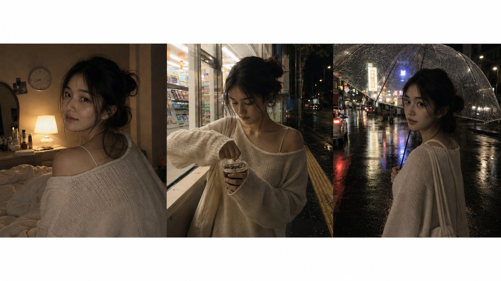
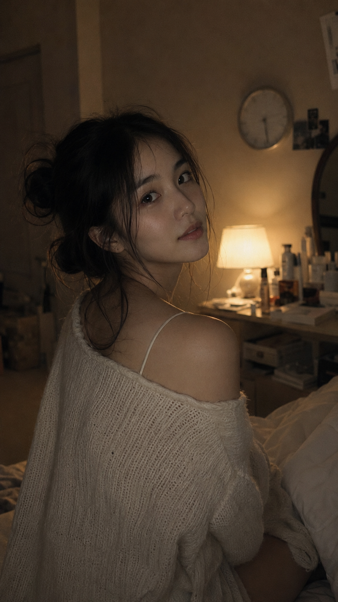
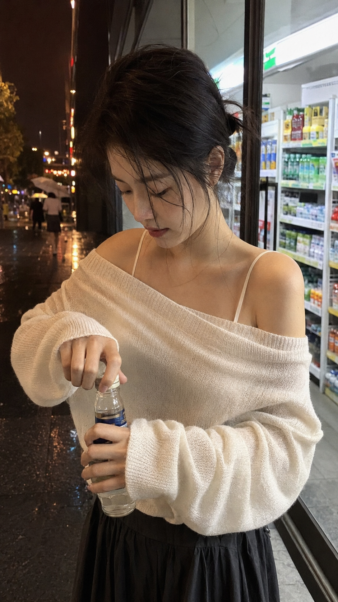
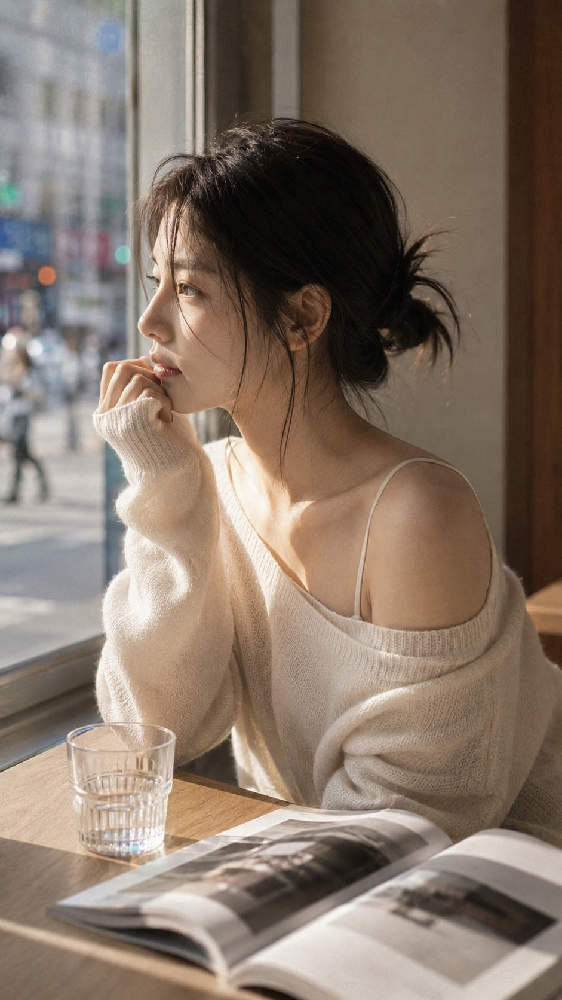
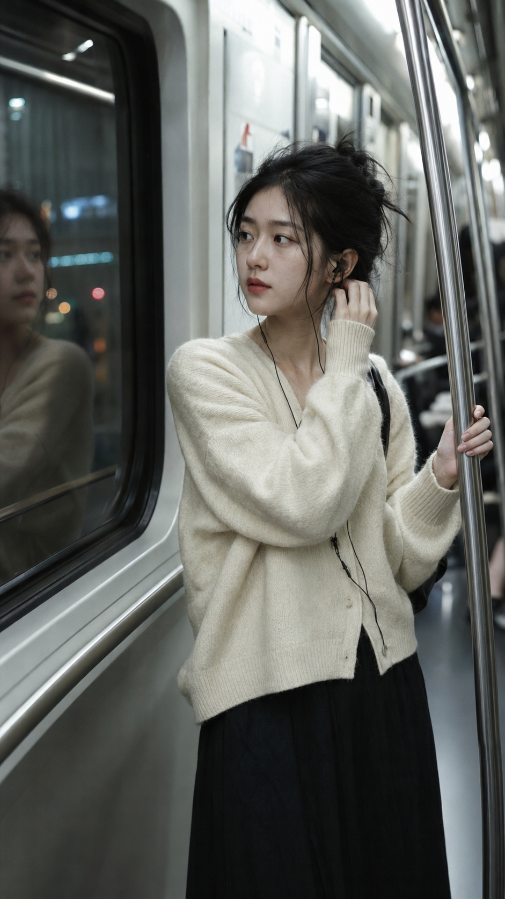
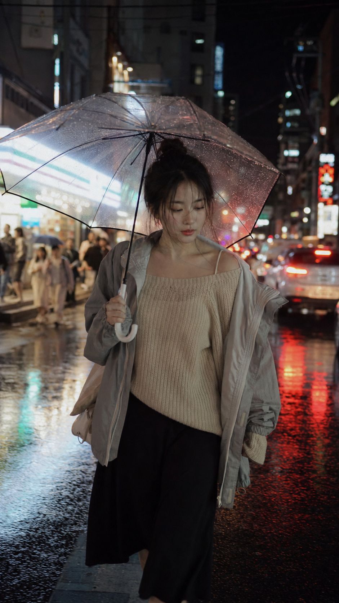

# 豆包生成韩系女友感写真，复制提示词就能出图

图友们大家好，今天这一期是「韩系女友感抓拍写真」。

这一组适合想做小红书头像、朋友圈生活照、韩系电影感写真参考的朋友。整体方向不是棚拍精修，而是卧室、便利店、咖啡馆、地铁、雨夜街头和酒店走廊里被随手拍到的一瞬间。

提示词主要按 GPT Image 2 的中文自然语言写法整理，也可以直接拿到豆包、千问及其他支持中文提示词的生图工具里尝试。不同工具出图会有差异，建议优先微调画幅、镜头、人物年龄和光线强弱。

这次前面先放一张三宫格拼图，方便你快速感受整组风格：低饱和、轻胶片、自然皮肤纹理、亲密但不过度摆拍。

## 昏暗卧室床头灯抓拍

适用场景：适合生成偏亲密、居家、轻复古的韩系卧室抓拍照，适合头像、图集开篇或氛围封面参考。

提示词：

9:16 竖版抓拍人像，一位 22-28 岁年轻中国女性在昏暗卧室中回头看向镜头，五官自然清秀，面部干净，健康自然肤色，气质清爽亲和。她穿着宽松米白色露肩针织毛衣，里面搭配浅色细肩带吊带背心，头发随意盘成凌乱丸子头，几缕碎发自然垂落在脸侧。单盏床头灯散发温暖琥珀色环境光，背景是略显杂乱但有生活气息的房间，可见墙钟、梳妆架和一些散落物品。背景柔焦，脸部和肩部清晰对焦，真实自然的皮肤纹理，轻微毛孔质感，不过度磨皮，嘴唇微微张开，与镜头有温柔的眼神交流。复古胶片颗粒，低饱和暖色调，低对比度，轻微暗角，氛围亲密自然，像韩系偶像写真集的抓拍感，无水印，无文字，避免 AI 美女脸、网红感、过度精修、塑料皮肤、暗沉肤色、明显痘印、明显皱纹、斑点、面部变形。

拆解：这条的重点是“单盏床头灯 + 杂乱生活背景 + 回头看镜头”。如果画面太商业，可以加强“真实卧室、随手抓拍、低对比度”。

## 夜晚便利店门口低头拆饮料

适用场景：适合生成夜晚街头感、小红书生活照、韩系便利店电影感照片。

提示词：

9:16 竖版抓拍人像，一位 22-28 岁年轻中国女性站在夜晚韩系街头便利店门口，低头正在拆开一瓶冰饮，眼神没有直接看镜头，像是被偶然捕捉到的瞬间，五官自然清秀，面部干净，健康自然肤色，气质清爽亲和。她穿宽松米白色露肩针织毛衣，内搭浅色细肩带吊带，搭配深色半身裙，头发随意盘成凌乱低丸子头，几缕碎发被夜风吹到脸侧。便利店冷白灯光从身后溢出，街道路灯带来暖黄色边缘光，湿润地面反射轻微霓虹。背景有便利店货架、玻璃门、路边行人虚影。脸部和手部清晰对焦，背景柔焦，自然唇色，鼻尖带一点被夜风吹过的微红感但面部状态干净。复古胶片颗粒，低饱和冷暖混合色调，低对比度，轻微暗角，韩系电影抓拍感，无水印，无文字，避免 AI 美女脸、网红感、过度精修、塑料皮肤、暗沉肤色、明显痘印、明显皱纹、斑点、面部变形。

拆解：这条靠冷白便利店灯和暖黄路灯制造层次，动作不要太摆拍，低头拆饮料会比直视镜头更自然。

## 咖啡馆窗边侧脸发呆

适用场景：适合生成安静、干净、午后自然光的韩系生活写真，也适合朋友圈配图。

提示词：

9:16 竖版人像，一位 22-28 岁年轻中国女性坐在韩系极简咖啡馆靠窗位置，侧脸看向窗外，神情安静，像是在发呆，五官自然清秀，面部干净，健康自然肤色，气质清爽亲和。她穿宽松米白色露肩针织毛衣，内搭浅色细肩带吊带，肩颈线条自然放松。头发随意盘起，几缕碎发垂落在耳边和脸侧。窗外是模糊的城市街景、行人和车辆光影，室内有浅木色桌面、透明玻璃杯和一本翻开的杂志。午后自然光从窗外斜照进来，在脸侧形成柔和轮廓光。画面浅景深，脸部侧面、肩部和手指清晰，背景柔焦，真实皮肤纹理，轻微毛孔质感，不过度磨皮，低饱和奶油色调，轻微胶片颗粒，低对比度，韩系生活写真抓拍氛围，无水印，无文字，避免 AI 美女脸、网红感、过度精修、塑料皮肤、暗沉肤色、明显痘印、明显皱纹、斑点、面部变形。

拆解：这里不要让人物变成精修棚拍，关键词可以保留“靠窗、浅木色桌面、翻开的杂志、午后自然光”。

## 夜晚地铁车厢整理耳机线

适用场景：适合生成都市通勤、地铁车厢、夜归路上的韩系抓拍感。

提示词：

9:16 竖版抓拍人像，一位 22-28 岁年轻中国女性站在夜晚地铁车厢靠门位置，一只手轻轻扶着扶手，另一只手整理耳机线，眼神自然看向车窗倒影，五官自然清秀，面部干净，健康自然肤色，气质清爽亲和。她穿米白色宽松针织开衫，内搭浅色细肩带吊带，搭配深色长裙或半身裙。头发松散盘起，碎发贴在脸侧。车厢内冷白灯光与窗外城市灯影交错，玻璃上有模糊倒影，背景是虚化的乘客、扶手和地铁门线条。主体面部清晰，背景轻微运动模糊，像真实通勤途中被随手拍下。皮肤质感真实自然，妆容清淡，眼神带一点安静的夜归情绪但整体状态清爽耐看。低饱和冷色调，胶片颗粒，轻微暗角，韩系都市通勤抓拍感，无文字，无水印，避免 AI 美女脸、网红感、过度精修、塑料皮肤、暗沉肤色、明显痘印、明显皱纹、斑点、面部变形。

拆解：地铁这条重点是“车窗倒影”和“轻微运动模糊”，能把普通通勤照做出电影感。

## 雨夜街头撑伞行走

适用场景：适合生成雨夜电影感、韩系街拍、朋友圈以为真去首尔的氛围图。

提示词：

9:16 竖版街拍人像，一位 22-28 岁年轻中国女性在雨夜的韩系城市街头撑着透明雨伞向前走，视线微微向下看着路面，没有看镜头，五官自然清秀，面部干净，健康自然肤色，气质清爽亲和。她穿宽松米白色露肩针织毛衣，外搭浅灰色薄外套，内搭浅色细肩带吊带，下身搭配深色半身裙。头发随意盘成凌乱丸子头，几缕湿润碎发贴在脸颊旁。街边霓虹灯、便利店招牌和汽车尾灯在湿润地面形成柔和反光。伞面上有细小雨滴，人物脸部被路灯和招牌光轻轻照亮。画面有轻微运动模糊，背景行人和街景柔焦。真实皮肤纹理，自然唇色，情绪克制安静。复古胶片颗粒，低饱和暖灰色调，低对比度，轻微暗角，韩系雨夜电影感，无水印，无文字，避免 AI 美女脸、网红感、过度精修、塑料皮肤、暗沉肤色、明显痘印、明显皱纹、斑点、面部变形。

拆解：如果雨夜太暗，可以把“人物脸部被路灯和招牌光轻轻照亮”提前，保证脸部不会糊成一片。

## 酒店走廊低头整理碎发

适用场景：适合生成旅行酒店、走廊纵深、亲密随手拍的韩系写真。

提示词：

9:16 竖版抓拍人像，一位 22-28 岁年轻中国女性站在韩系酒店或公寓走廊中，微微低头整理耳边碎发，眼神垂下，姿态自然松弛，五官自然清秀，面部干净，健康自然肤色，气质清爽亲和。她穿宽松米白色露肩针织毛衣，内搭浅色细肩带吊带，肩膀线条被暖光柔和勾勒。头发随意盘成凌乱丸子头，几缕碎发从鬓角落下。走廊是暖白色灯光，墙面浅米灰色，门框和地毯形成纵深线条，背景轻微虚化。画面像朋友或恋人随手拍到的一个停顿瞬间。脸部、锁骨和手指清晰对焦，真实自然皮肤纹理，妆容清透，嘴唇自然微张。低饱和暖色调，胶片颗粒，低对比度，轻微暗角，亲密自然的韩系抓拍氛围，无水印，无文字，避免 AI 美女脸、网红感、过度精修、塑料皮肤、暗沉肤色、明显痘印、明显皱纹、斑点、面部变形。

拆解：走廊纵深线条很重要，门框、地毯和暖白灯光能让画面更有空间感。

## 使用建议

1. 想更真实：保留“自然皮肤纹理、轻微毛孔质感、不过度磨皮、低对比度”，不要额外加入“精修大片”“绝美”等词。
2. 想更韩系：把场景控制在卧室、便利店、咖啡馆、地铁、雨夜街头、酒店走廊这类生活空间，再加低饱和胶片颗粒。
3. 想换工具：豆包、千问、GPT Image 2 都可以尝试，先保持 9:16 竖版和中文自然语言，再按出图结果微调光线、人物年龄和背景细节。

建议收藏这一组 Prompt。后续只要替换动作、城市和光线，就能继续延伸出更多韩系日常写真；也欢迎在评论区留言你想要的下一组风格。

## 往期回顾

本系列刚开始更新，后续会继续补齐同类型主题。

#GPTImage2 #豆包 #千问 #生图提示词 #Prompt #韩系风格摄影系列 #韩系女友感 #写真 #小红书头像
